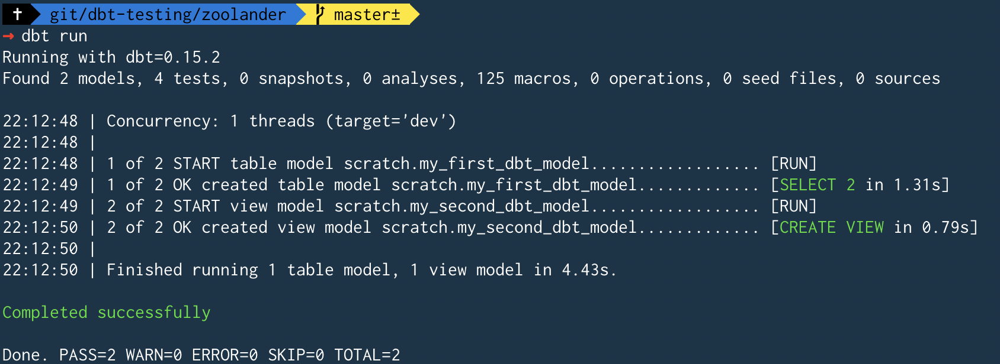
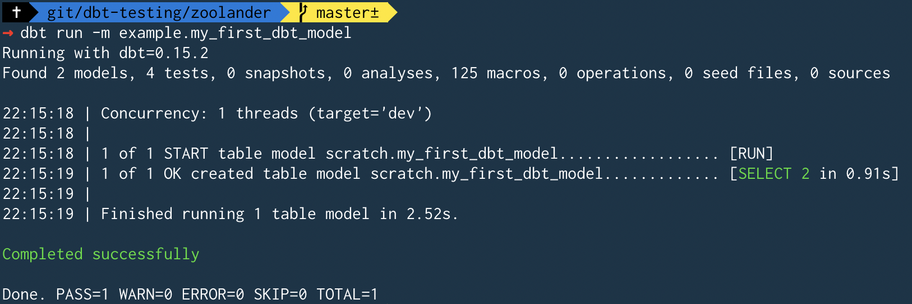

# dbt-testing

## Setup

### Enviroment Setup

```bash
pipenv install
pipenv shell
pipenv install dbt
```

### dbt Project Setup

Ran `dbt init zoolander`.

Created the folder structure you see in this repo.

```
├── README.md
├── analysis
├── data
├── dbt_project.yml
├── macros
├── models
│   └── example
│       ├── my_first_dbt_model.sql
│       ├── my_second_dbt_model.sql
│       └── schema.yml
└── tests
```

After reading through the docs, here are my notes on each of these folders and what they are meant for:

**analysis**

As described [here](https://docs.getdbt.com/docs/analyses), the `analysis` folder is for users to save & version "analytical" sql files.

**data**


### Database Setup

I have an existing postgres database running on AWS. I created a new database named `zoolander`, then created some new schemas:

```sql
CREATE SCHEMA raw_zoolander;

CREATE SCHEMA scratch;

CREATE SCHEMA zoolander;
```

### Profiles Setup

I created a `profiles.yml` in the root of the repo, since all my credentials are being populed from environment variables. As discussed [here](https://docs.getdbt.com/docs/configure-your-profile#section-advanced-profile-configuration), you can keep your `profiles.yml` in a directory other than the default `~/.dbt/` folder.

`dbt debug --profiles-dir .`


# Up & Running

## First Example Runs

Having to specify `--profiles-dir .` everytime is getting annoying, so adding this to my `~/.zshrc`:

```bash
export DBT_PROFILES_DIR=/Users/ianwhitestone/Documents/git/dbt-testing/zoolander
```

Run all models specified in `dbt_projects.yml`:

`dbt run`



Or just run a single model:

`dbt run -m example.my_first_dbt_model`



# Resources

* Great overview of all the settings in the [`dbt_project.yml`](https://docs.getdbt.com/docs/dbt-projects)

# TODO

* [ ] Finish reading through docs
* [ ] Walk through the `dbt.log` file, + the compiled target for a given run
* [ ] Mock up some example data in a bunch of schemas then test some realistic jobs..
* [ ] Mock up a job and/or data that would fail...understand the debugging process
* [ ] Understand how incremental jobs work
* [ ] How would we implement data freshness checks prior to running. Maybe Airflow? 
* [ ] Think about how multiple teams could own their own models & configurations
* [ ] How to handle slack alerting on failure & sharing logs
