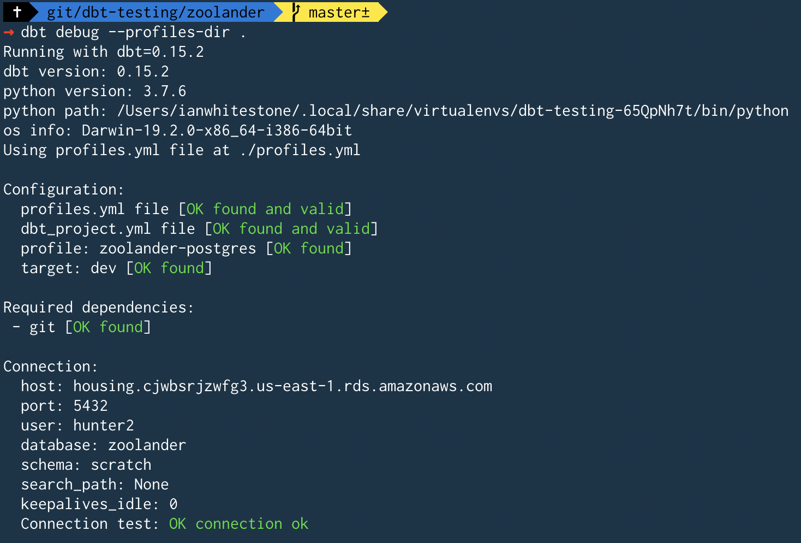

# dbt-testing

## Setup

```bash
pipenv install
pipenv shell
pipenv install dbt
```

## Project Setup

Ran `dbt init zoolander`.

Created the folder structure you see in this repo.

## Sample Database Setup

I have an existing postgres database running on AWS. I created a new database named `zoolander`, then created some new schemas:

```sql
CREATE SCHEMA raw_zoolander;

CREATE SCHEMA scratch;

CREATE SCHEMA zoolander;
```

## Profiles Setup

I created a `profiles.yml` in the root of the repo, since all my credentials are being populed from environment variables. As discussed [here](https://docs.getdbt.com/docs/configure-your-profile#section-advanced-profile-configuration), you can keep your `profiles.yml` in a directory other than the default `~/.dbt/` folder.

`dbt debug --profiles-dir .`

